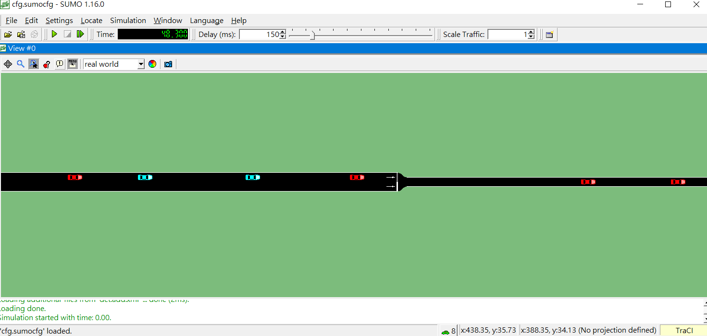

# Lane-Merging-survey-experiment
An on-ramp or work-zone event may severely slow the traffic, so finding a strategy for lane-merging is important and is trending in the intelligent vehicle industry. In this report, a survey and an experiment are conducted. The survey aims for papers about different aspects of lane merging such as passing order, merging point, and trajectory. The experiment shows the performance with different strategies.  
  
* More details can be found in the report ``Survey_and_Experiment__Lane_Merging.pdf``.
* The source code used in the experiment can be found in ``/Sumo``.

